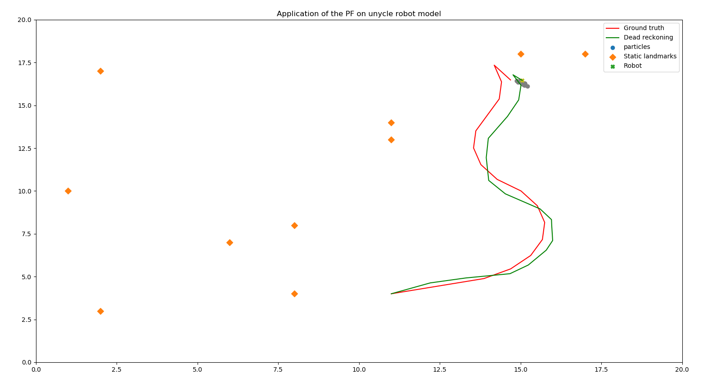

# particle filter

## Project aims

The purpose of this repository is to write a particle filter to track the location of a moving point robot
in an environment with static landmarks. The robot is represented in a Graphical Interface (GI) and can be controlled
using the keyboard. 
The robot is modellised by a unicyle model with forward and rotational velocity as control inputs.

The groundtruth, the dead-reckoning and the estimation made thanks to the particle filter are also represented in the GI. 

## How does a particle filter works ?

Particle Filters are one of the most popular tracking tools used in robotics for more than 2 decades in different applications.
It is especially useful when the environment in which the robot evolves is known but not necessarly its first position. 

The filter's name comes from it's principle : instead of trying to define a position as an estimation of the robot's position, 
it will abstract particles distributed in the world and that will represent possible states, in this case positions, of the robot. 
Some particles will be closer to the robot and therefore more consistent and more interesting in terms of modelling. This difference 
of importance will be quantified using weights : each particule has a weight and the higher it is, the more representative the particule is.

To keep up with the robot's movements, the position of the particles will be updated each time following the same kinematic model as the robot. 
This model will be injected with noises related to the actuators in order to simulate the real behavior of the robot. At this point,
some particules might have strayed further from the robot, it is therefore necessary to recompute the weight of each particules in order 
to rank them according to their consistency. Once it is done, some particules might be so far away from the robot that they might become 
non-significant regarding the modelling. This is when the resampling take place in order to duplicate the most important particules and the 
get ride of the further ones. 

Thanks to those steps, it is possible to get a cloud of particles around the position of the robot after sometime and therefore to estimate the 
position of the robot. 

## Render

This is what this project is meant to do. The robot can be controlled thanks to the key arrows and the following view should appear in a window 

Here we can see the static landmarks represented by orange dots, the ground truth (ideal trajectory of the robot) in orange and the dead reckoning trajectory (real trajectory with actuators'noise) in green. 

Around the position of the robot, represented by a cross, we can see several grey points which are the particule at the current timeframe. 
It is not always easy to distinguish the robot position of the particles are they are often overlapping. 

## Quickstart 

To launch the projet for the first time, execute : 
``
pip install -r requirements.txt
``

Then to run the project, do : 
``
sudo python base.py
`` 
in the project folder.

A graphic window should appear. The position of the robot is represented by a cross. To control the robot : 

- :arrow_right: : move forward 
- :arrow_left: : move backward 
- :arrow_up: : rotate clockwise
- :arrow_down: : rotate counterclockwise

Once you want to close the project, close the GI window and press the 'q' key on your keyboard. 

## The code explained 

### Overview of the files 

For the sake of clarity and modularity, the project has been divided in several files :
- **base.py** : the main file of the project that gather all the other classes and handle their communication and the graphical interface.
The base class tends to represent the world and is therefore compound of a robot using a sensor distance, a list of static landmarks, a graphical interface's handler
and a particle filter. 

- **robot.py** : It represents all the components of the robot, meaning the robot and the distance sensor classes. To respect strictly the principle of the Object Oriented
Programmation, an instance of the distance sensor should belongs to the robot but in this particular case, the sensor is a "magical" device than can 
can estimate the distance of the robot between the robot and the static landmarks and always attribute the right landmark to the right computation. 
Therefore, distance sensor is an attribute of the base class. 

- **particleFilter.py** : Here is the implementation of the the particle Filter. I used this 
[very well documented article](https://share.cocalc.com/share/7557a5ac1c870f1ec8f01271959b16b49df9d087/Kalman-and-Bayesian-Filters-in-Python/12-Particle-Filters.ipynb?viewer=share)
to implement a Sampling Importance Resampling filter algorithm as explained in the [previous section](#how-does-a-particle-filter-works-).

- **utils.py** : This file is used to store classes or functions that can be used in several files and that are more of helpers than real abstractions. 
In this project, the utils file only contains the implementation of the position(x,y,&theta;) and its dedicated functions. I still wanted to make it a separate file 
as it is a often a file that grow during a project. 

I will now describe the most important parts of this project, one file at the time.

### Base.py 

As mentionned in the previous part, base.py gathers all the different components and classes of the project. It tends to represent the world of 
the simulation and therefore the three main parts : the graphical interface which is event sensitive, the robot and its components and the particle
filter. The static landmarks are also represented but the only their static positions are used. 

When the project is launched, a while loop is initialized **until the 'q' key is pressed**. It does not do anything but it keeps the program active
and listening to the event's callback. 
To get to this callback, one of the arrow keys should be pressed. The main routine of the program will then be executed. It consists in :

- Getting the pressed key and updating the robot's position accordingly (left and right arrows to move respectivly forward and backward 
with respect to the robot's heading and up and down arrows to change the robot's orientation)

- Simulate the behavior of a "magical" sensor that can compute the current distance of the robot to every landmarks with a certain noise

- Execute the main steps of the particle filter which are predicting the position of each particle, updating their weight according to 
their distances to each landmarks and finally resample the particules based on their weights. 

- Update the Graphical Interface 

Base.py also contains the Graphical Interface handlers that store the groundtruth and the dead-reckoning trajectories as well as the current particle's 
repartition in the world.

### Robot.py

Robot.py contains the implementation of the robot's unycle model. It main function is to update the robot's position and orientation when the arrow 
keys are pressed and mimic the noise that would come from real actuators. 

Let's (v,&omega;) be the input, respectively the linear and the heading velocities. Let's (x,y,&theta;) be the state of the robot. 
Finally, let's (&gamma;v,&gamma;&omega;) the noise for corresponding to v and &omega; .
The kinematics model used here is : 

> &theta; = &theta; + &omega; &Delta;t +  &gamma;&omega;

> x = x + v&gamma; cos(&theta;)

> y = y + v&gamma; sin(&theta;)

with v&gamma; = v &Delta;t + &gamma;v and &Delta;t the time of movement

(&gamma;v,&gamma;&omega;) are simulated through the standard deviation of the actuators and have be arbitrarly chosen 
to be [0.3,0.1].

### ParticleFilter.py 

The particle filter is defined through a list of particles, randomly distributed in the world at the initialization of the simulation. 
Each particles has a position (x,y,&theta;) and a weight. 
As mentionned above, they are four main steps in a particle filter : 

- **the prediction** : 

When the robot moves, the position of the particles has to be updated accordingly in order to estimate the 
current position of the robot. To do so, the particles have to mode exactly in the same manner as the robot. This is the reason why 
in the prediciton phase, the new particule's position is recomputed using the same function as the robot, which is a function of the 
Position class. 
For this reason, the noise injected in the equation comes from the same standard deviation as it is supposed to come from the same actuators.

- **the weights update** : 

Once the new position of every particule has been computed, it is possible to compare the distance between the particles 
and the static landmarks and to see how close it is to the distance between the robot and the landmarks. 
If a particule is close to the robot, then it should be just as far as all the landmarks. If so, the considered particule will be more likely to be 
the current position of the robot and its weight should be high to underline this fact. 
To express this likelihood between the difference of the distances and the likelihood of one particule's state, the difference is defined as a normal
continuous random variable having the difference between the particule and the considered landmark as mean and the precision of the sensor as scale. 
Then, the  probability density function is build which will ponderate the difference between the distances or in other words, the difference between 
the position of the robot and the particule. 

NB : The distance sensor is supposed to be an ideal device capable of knowing the distance between the robot (and the particules) and every landmarks. 
This is why we can use all the landmarks to compute the weight of each particule. In addition, we consider that the sensor is capable of drawing a 
distinction between all the landmarks and we do not have to find which landmark correspond to which when we do our computation (which would be the case
with a real sensor)

- **the resampling** :

Now that all the particules have been weighted, it is time to decide which ones are consistents and close of the robot and which ones have to be 
forgotten. To keep the same number of particules during all the simulation, we will have to keep the existing particules that were a good fit for 
the model and represent them several time in the list of particules to delete the inconsistent'ones. 
But how do to choose which to keep and which to forget ? 
Several methods exist to resample based on the likelihood of particules and I chose to use the stratified resampling. 
The aim of this resampling is to choose particules uniformly among the particules'repartition. To do so, the cumulative sum, i.e. a sequence composed of the cumulated particules' weights, is divided in as many parts as they are particules. Once it is done, a particule will be randomly chosen among each sub division. For this reason, the particules will be sufficiently appart and therefore will cover a larger area around the robot's position. It also ensure that higher weights are resampled more than once which helps getting closer to the actual position of the robot.

## Comments and todo
